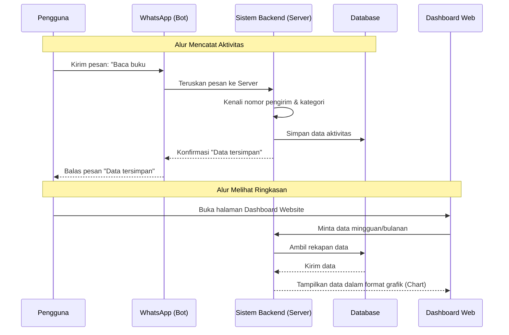
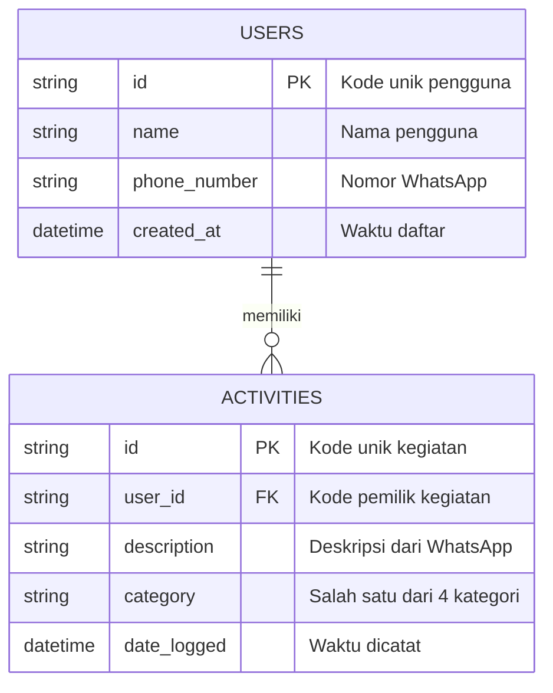

# PRD — Project Requirements Document

## 1. Overview
Banyak orang ingin melacak kegiatan harian mereka untuk mencapai target (seperti produktivitas, kesehatan, olahraga, dan belajar), namun sering kali merasa malas jika harus membuka aplikasi khusus setiap kali selesai melakukan aktivitas. 

Aplikasi ini hadir sebagai solusi pelacak kegiatan harian pribadi yang super praktis. Pengguna cukup mengirim pesan chat melalui WhatsApp untuk mencatat aktivitasnya. Semua data yang dikirim via WhatsApp akan otomatis direkap dan dapat dilihat melalui *Dashboard Web* yang menampilkan ringkasan pencapaian secara mingguan dan bulanan. Tujuan utama aplikasi ini adalah membuat kebiasaan mencatat aktivitas menjadi semudah mengirim pesan kepada teman.

## 2. Requirements
Persyaratan utama agar proyek ini berjalan sesuai rencana:
*   **Platform Utama:** Sebuah Web App (aplikasi berbasis website yang bisa dibuka di HP maupun Laptop) untuk melihat grafik dan ringkasan data.
*   **Integrasi WhatsApp:** Sistem harus bisa menerima dan membaca pesan dari WhatsApp pengguna secara otomatis (menggunakan WhatsApp Bot).
*   **Kategori Khusus:** Aplikasi fokus mendata 4 kategori utama: Produktivitas, Kesehatan, Olahraga, dan Belajar.
*   **Notifikasi:** Mendukung *Push Notification* (notifikasi web) untuk mengingatkan pengguna agar tidak lupa mencatat kegiatannya hari itu.
*   **Akses dan Biaya:** Aplikasi ditujukan untuk penggunaan pribadi dan 100% gratis.
*   **Desain:** Antarmuka (User Interface) standar yang bersih, rapi, dan mudah dibaca.

## 3. Core Features
Fitur-fitur inti yang wajib ada di dalam aplikasi:
*   **Input Pintar via WhatsApp:** Pengguna bisa mengetik pesan santai seperti "Hari ini lari 30 menit #olahraga" atau "Baca buku bab 1 #belajar" langsung ke nomor WhatsApp Bot.
*   **Dashboard Visual (Web):** Halaman web interaktif yang menampilkan grafik dan diagram ringkasan aktivitas dalam rentang waktu mingguan dan bulanan.
*   **Sistem Kategori Otomatis/Manual:** Aktivitas dikelompokkan ke dalam kategori (Kesehatan, Produktivitas, Olahraga, Belajar) berdasarkan *hashtag* (#) yang dikirim pengguna di WhatsApp.
*   **Pengingat Harian (Push Notification):** Pengingat otomatis di browser atau pesan WhatsApp jika pengguna belum mencatat aktivitas apa pun hingga sore/malam hari.
*   **Sistem Akun Sederhana:** Pengguna mendaftar menggunakan nomor WhatsApp atau email agar data pribadinya aman dan tidak bercampur dengan orang lain.

## 4. User Flow
Langkah-langkah sederhana perjalanan pengguna dari awal mencoba hingga rutin memakai aplikasi:
1.  **Pendaftaran:** Pengguna membuka website, membuat akun, dan mendaftarkan nomor WhatsApp mereka.
2.  **Mencatat Aktivitas:** Setelah selesai berolahraga, pengguna membuka WhatsApp, mencari kontak Bot aplikasi, lalu mengetik pesan: *"Gym 1 jam #olahraga"*. Bot membalas: *"Aktivitas berhasil dicatat!"*.
3.  **Pengingat:** Jika sampai jam 8 malam pengguna belum mengirim pesan apa-apa, sistem akan mengirimkan notifikasi pengingat.
4.  **Evaluasi Diri:** Di akhir minggu, pengguna membuka website dan masuk ke Dashboard. Pengguna melihat grafik yang menunjukkan seberapa banyak waktu yang dihabiskan untuk *Kesehatan*, *Belajar*, dll minggu ini.

## 5. Architecture
Berikut adalah gambaran sederhana bagaimana sistem saling terhubung. Saat pengguna mengirim pesan di WA, sistem akan menangkapnya, menyimpannya, lalu menampilkannya saat pengguna membuka website.

## 6. Database Schema
Untuk menyimpan data, kita membutuhkan semacam "buku catatan digital" (Database). Kita hanya butuh dua tabel utama: tabel untuk menyimpan informasi pengguna, dan tabel untuk menyimpan daftar aktivitas mereka.

*   **Tabel `Users` (Data Pengguna)**
    *   `id` (Text/UUID): Kode unik untuk mengenali pengguna.
    *   `name` (Text): Nama pengguna.
    *   `phone_number` (Text): Nomor WhatsApp pengguna (penting untuk mencocokkan pesan yang masuk).
    *   `created_at` (DateTime): Waktu kapan akun pertama kali dibuat.

*   **Tabel `Activities` (Data Kegiatan)**
    *   `id` (Text/UUID): Kode unik untuk setiap kegiatan yang dicatat.
    *   `user_id` (Text/UUID): Kode unik pengguna (menghubungkan kegiatan dengan siapa yang melakukannya).
    *   `description` (Text): Isi pesan atau deskripsi aktivitas (contoh: "Lari pagi").
    *   `category` (Text): Kategori aktivitas (Produktivitas / Kesehatan / Olahraga / Belajar).
    *   `date_logged` (DateTime): Tanggal dan waktu aktivitas tersebut dicatat.

**Diagram Hubungan Antar Tabel (Entity Relationship):**

## 7. Tech Stack
Karena sistem ini perlu dibuat dengan standar yang modern, cepat, namun tetap ringan dan gratis (sesuai kebutuhan Anda), berikut adalah fondasi teknologi yang direkomendasikan. Bahasa teknis di bawah ini adalah panduan yang bisa langsung diberikan kepada pembuat program (programmer):

*   **Frontend & Backend (Kerangka Aplikasi Utama):** `Next.js` — Gabungan pembuat tampilan web dan pengelola server dalam satu tempat. Sangat efisien untuk aplikasi tipe ini.
*   **Tampilan & Desain (UI/UX):** `Tailwind CSS` & `shadcn/ui` — Blok bangunan desain yang membuat antarmuka (tombol, formulir, grafik) terlihat rapi dan standar tanpa perlu mendesain dari nol.
*   **Manajemen Database (ORM):** `Drizzle ORM` — Jembatan penghubung antara kode program dengan database agar pengambilan data lebih cepat dan aman.
*   **Database (Tempat Penyimpanan):** `SQLite` (seperti Turso) — Database ringan yang sangat cocok untuk aplikasi skala pribadi dan sepenuhnya gratis.
*   **Sistem Login (Auth):** `Better Auth` — Sistem keamanan login yang mudah dipasang.
*   **Koneksi WhatsApp:** `Meta WhatsApp Cloud API` atau `Twilio` — Jasa pihak ketiga yang resmi untuk bisa membuat Bot WhatsApp dan membaca pesan pengguna.
*   **Deployment (Server Hosting):** `Vercel` — Layanan hosting gratis dan super cepat untuk menghidupkan aplikasi web ini agar bisa diakses internet.